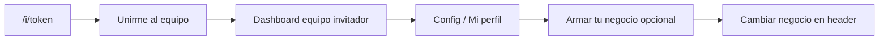

# Frontend — Stores, Layout, Onboarding

## Stores Zustand (`src/stores/`)

Solo estado UI efímero — no persistir datos de servidor acá.

### `kanban-ui.store.ts`
- drag state
- modales: `create`, `detail`, `dictate`
- `selectMode` — selección múltiple de cards
- filtros: `searchQuery`, `priority`, `locationId`
- columnas activas

### `scrum-ui.store.ts`
- `selectedSprintId: string | null`
- `viewMode: 'board' | 'backlog'`

**Regla:** fuente de verdad compartida entre `page.tsx` y `CreateTaskModal`. NO crear estado local para filtro de sprint.

### `team-ui.store.ts`
- búsqueda de miembros
- filtros de rol/ubicación
- modal de invitación

## React Query (`src/hooks/`)

- Queries: `src/hooks/queries/` — query keys co-localizados en el archivo
- Mutations: `src/hooks/mutations/`
- Funciones HTTP: `src/lib/api/` (e.g. `tasksApi`, `membersApi`, `billingApi`)

## Layout del dashboard (`src/app/dashboard/layout.tsx`)

Layout principal `'use client'`. Contiene:

- **Sidebar** (`src/components/layout/sidebar.tsx`) — navegación colapsable. Cada item tiene `tourId` para el onboarding. Items: Dashboard, Tareas, Planificación, Equipo, Reportes, Facturación, Configuración, Ayuda.
- **Header** (`src/components/layout/header.tsx`) — título dinámico por ruta, buscador en `/dashboard/tareas`, botón `?` (→ `/dashboard/ayuda`), campana de notificaciones, `BusinessSwitcher`, avatar + rol, logout.
- **FAB IA** (`id="tour-fab"`) — botón flotante bottom-right → abre `AiAssistantPanel`. Punto de entrada al asistente IA y al dictado de tareas.
- **OnboardingTour** — componente invisible que gestiona el tour con driver.js.

## Onboarding Tour (`src/components/layout/onboarding-tour.tsx`)

Tour interactivo con driver.js.

**Auto-inicio:** primera vez que el usuario visita `/dashboard`. Persiste en `localStorage` con key `tour_completed_{userId}`.

**Trigger manual desde cualquier lugar:**
```ts
import { startOnboardingTour } from '@/components/layout/onboarding-tour';
startOnboardingTour();
// dispara window.dispatchEvent(new CustomEvent('start-onboarding-tour'))
// ignora el estado de localStorage
```

**Pasos (por orden):** Dashboard → Tareas (Kanban) → FAB IA → Planificación → Equipo → Reportes → Facturación → Configuración → Ayuda.

Para usuarios que **no son dueños** del negocio activo (`isOwner === false`), se omiten los pasos **Equipo** y **Facturación** del tour.

Cada paso usa `element: '#tour-nav-xxx'`. Si el elemento no existe en el DOM, el paso se omite automáticamente.

**Página de ayuda** (`src/app/dashboard/ayuda/page.tsx`): acordeón estático (no usa `@radix-ui/react-accordion` — no está instalado). El botón "Ver tour" llama a `startOnboardingTour()`. Secciones cubiertas: Dashboard, Tareas (kanban, agenda, recurrencia, checklist, sprint tabs), Planificación, Equipo (flujo de invitación, espacio propio opt-in, troubleshooting), Reportes, Facturación, Configuración (incl. **Armar tu espacio** y selector del header), Notificaciones push. Mantener sincronizado con [`docs/invites-and-accounts.md`](invites-and-accounts.md), `docs/tasks.md` y `docs/permissions.md`.

**Invitar usuario** (`src/components/equipo/create-user-modal.tsx`): formulario único (nombre, correo, rol base, sectores opcionales). En equipo crea un `BusinessInvite` de un solo uso (`POST /api/invites` con `email`) y envía el link `/i/{id}`. Superadmin sigue usando `POST /api/users/create` en modo correo (sin contraseña en el modal).

## Rutas de la app

```
src/app/
├── (auth)/           # login, register, forgot-password — sin sidebar
├── (superadmin)/     # panel TecnoFusión — superadmin-sidebar
│   └── superadmin/
│       ├── planes/
│       ├── businesses/
│       ├── users/
│       ├── subscriptions/
│       └── audit/
├── dashboard/        # layout 'use client' + ProtectedRoute + Sidebar + Header
│   ├── tareas/        # Kanban | Agenda | Calendario | Cronograma
│   │   ├── agenda/
│   │   ├── calendario/  # FullCalendar
│   │   └── cronograma/  # Gantt
│   ├── planificacion/
│   │   └── objetivos/
│   ├── equipo/
│   │   └── roles/
│   ├── sectores/          ← UI de Location (label configurable: Sedes, Sectores, etc.); ruta /equipo/sectores
│   ├── reportes/
│   ├── billing/
│   ├── config/
│   └── ayuda/
└── i/[token]/        # flujo de invitación
```

## Flujo de invitación

Ruta pública: `/i/[token]` (`invite-client.tsx`).

1. Usuario no autenticado: formulario inline **nombre + contraseña** (sin correo) → `POST /api/invites/{token}/prepare-account` genera username/email `@guest.local` → Firebase `register` → `POST /accept` con `{ username }` en un solo paso. Alternativas: **Google** (prod) o **login** con `?redirect=/i/{token}`.
2. **No** llamar `POST /api/auth/register` en flujos con redirect a `/i/…` — ese endpoint crea un negocio propio. El alta en PostgreSQL ocurre en `POST /api/invites/{token}/accept`.
3. Tras Firebase Auth sin perfil PG (Google/login), el usuario vuelve al link y pulsa **Unirme al equipo** si aún no aceptó.
4. `auth-context` no debe cerrar sesión en `/register` ni en `/i/…` durante el alta (rompe `getIdToken`). Ante `profile` 404 fuera de esas rutas, marca `notInvited` (no llama `POST /api/auth/register`).

Después de `accept.mutateAsync()` + `refreshProfile()`, **NO redirigir automáticamente**. Dejar que `accept.isSuccess` muestre CheckCircle + botón "Ir al dashboard". El usuario navega manualmente.

Copy en invite: "No vas a crear un negocio nuevo; te sumás al equipo de …". Post-alta: login futuro con **nombre + contraseña** (`GET /api/auth/resolve` resuelve nombre → email Firebase).

Ver también [`docs/invites-and-accounts.md`](invites-and-accounts.md) (resumen de una página).

## Colaborador vs. dueño de negocio

### Tabla de entradas

| Momento | Qué ve el usuario | Dónde |
|---------|-------------------|--------|
| Entra por `/i/{token}` | Nombre + contraseña inline, o Google/login + **Unirme al equipo** | `src/app/i/[token]/invite-client.tsx` — sin alta de negocio |
| Trabaja en el equipo invitador | Nombre del equipo en el header | `BusinessSwitcher` — solo contexto |
| Quiere su espacio (opt-in) | Formulario **Armar tu espacio** | **Configuración → Mi perfil** — lugar principal |
| Ya tiene espacio propio y quiere otro | **Crear otro espacio** | Menú del selector → `/register?newBusiness=true` |

### Tabla técnica (API / rutas)

| Entrada | Negocio propio |
|---------|----------------|
| `/i/{token}` + accept | No (hasta opt-in) |
| `/register` (sin redirect `/i/`) | Sí (`POST /api/auth/register`, `accountIntent: owner`) |
| Config → **Armar tu negocio** | **Primer** negocio propio (`POST /api/businesses`, `create-own-business-card.tsx`) |
| Header → selector → **Armar tu negocio** | Atajo a `/dashboard/config` si `hasOwnedBusiness === false` |
| Header → selector → **Armar otro negocio** | Negocios **adicionales** si ya es dueño de al menos uno |

### Flujo (mermaid)



### Archivos tocados (2026-05)

| Archivo | Cambio |
|---------|--------|
| `src/app/api/auth/profile/route.ts` | Sin auto-creación de `Business`; reasigna `businessId` desde memberships; `hasOwnedBusiness`, `canCreateOwnBusiness` |
| `src/app/api/auth/register/route.ts` | `preferences.accountIntent: 'owner'` |
| `src/app/api/invites/[token]/accept/route.ts` | Usuario nuevo → `accountIntent: 'collaborator'`, `joinedViaInviteAt` |
| `src/hooks/auth-context.tsx` | Sin `autoRegister`; `notInvited` ante profile 404 |
| `src/hooks/protected-route.tsx` | Requiere `user` de PostgreSQL, no solo Firebase |
| `src/app/(auth)/login/page.tsx` | Sin registro silencioso en Google; mensaje + link a `/register` |
| `src/app/i/[token]/invite-client.tsx` | Copy: no se crea negocio nuevo |
| `src/components/config/create-own-business-card.tsx` | Card opt-in en Config |
| `src/components/business-switcher.tsx` | Sin espacio propio → Config; con propio → register |
| `src/components/layout/onboarding-tour.tsx` | Omite Equipo/Facturación si `!isOwner` |

`GET /api/auth/profile` expone `hasOwnedBusiness` y `canCreateOwnBusiness` para la UI.

Ver [`docs/decisions/006-collaborator-vs-owner-account.md`](decisions/006-collaborator-vs-owner-account.md), [`docs/permissions.md`](permissions.md), [`docs/invites-and-accounts.md`](invites-and-accounts.md).

## Nomenclatura del espacio (terminología UI)

El nivel superior siempre es **Espacio** (`Business`). Las unidades internas (`Location` en Prisma) tienen label configurable por espacio.

| Capa | Prisma | Label UI default |
|------|--------|------------------|
| Espacio | `Business` | Espacio / Espacios |
| Tablero | `Project` | Tablero / Tableros |
| Unidad interna | `Location` | Sede / Sedes (configurable) |

**Configuración → pestaña Espacio** (solo admin/superadmin): preset (Sede, Sucursal, Departamento, Sector, Área, Negocio, Local) o personalizado. Se guarda en `business.settings.terminology` vía `PATCH /api/business/config` (merge profundo de `settings`).

Al crear o editar una unidad interna (`SectorModal`), el campo **Tipo** es un selector con los slugs de `business.settings.localeTypes` (o presets por defecto: local, sucursal, departamento, sector, área, negocio, sede) más tipos ya usados en locations existentes. Opción **Agregar otro tipo…** persiste el slug nuevo en `localeTypes` al guardar.

**Código:** `src/lib/terminology.ts` (`resolveSpaceLabels`, presets), hook `useSpaceLabels()` (`src/hooks/use-space-labels.ts`), card `src/components/config/space-terminology-card.tsx`. Consumidores: sidebar Equipo, pantalla `/dashboard/equipo/sectores`, modales de location, campo location en create-task.
