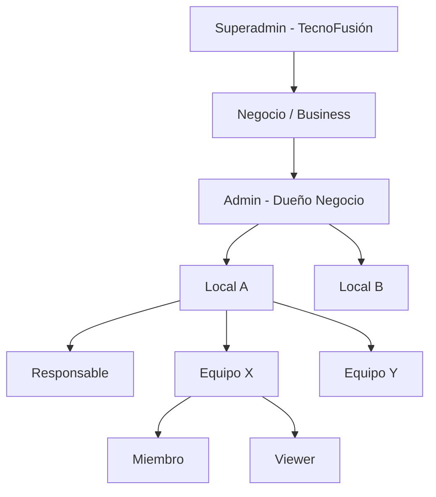
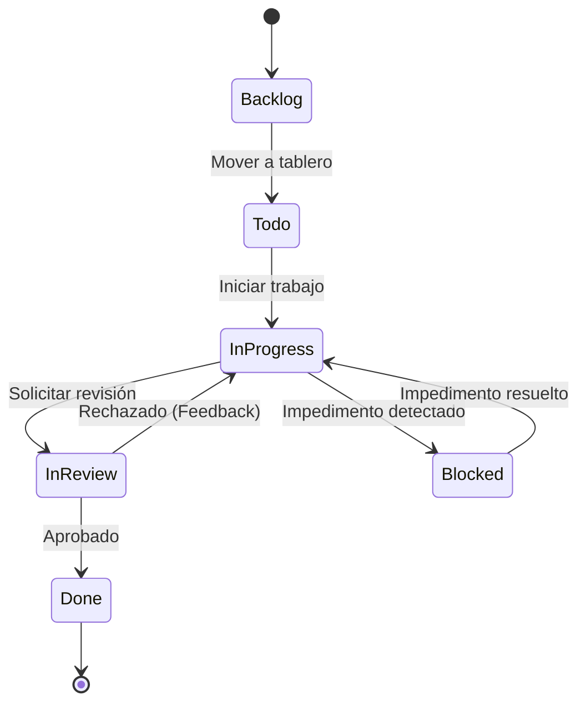
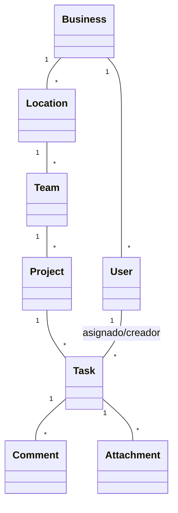

# Glosario y Modelos (Tablero de Control)

Este documento centraliza las definiciones de negocio y los modelos visuales que rigen la lógica del sistema, asegurando que todos los participantes (desarrolladores, analistas y usuarios) utilicen el mismo lenguaje.

## 1. Glosario de Términos

### 1.1 Términos de Negocio (Dominio)
- **Negocio (Business)**: Entidad raíz. Representa la empresa o cliente que contrata el sistema (ej. "Cadena de Restaurantes X"). Es el contenedor de más alto nivel para el multi-tenancy.
- **Local / Sede (Location)**: Una unidad física o lógica del negocio. Puede ser una sucursal, un depósito o un área operativa.
- **Equipo / Sector (Team)**: Grupo de usuarios dentro de un Local que comparten tareas y proyectos.
- **Tarea (Task)**: La unidad mínima de trabajo. Posee estado, prioridad, tipo y responsables.
- **Proyecto (Project)**: Contenedor que agrupa tareas relacionadas con un objetivo común y fechas definidas.
- **Sprint**: Período de tiempo fijo (ej. 14 días) donde un equipo se compromete a completar un set de tareas.
- **Responsable**: Usuario con autoridad sobre un Local o Equipo.

### 1.2 Términos Técnicos
- **RBAC (Role-Based Access Control)**: Control de acceso basado en roles. El sistema usa 5 niveles de jerarquía.
- **Multi-tenant**: Arquitectura que permite atender a múltiples clientes (negocios) desde una única instancia de software, aislando lógicamente sus bases de datos.
- **Repository Pattern**: Patrón que desacopla la lógica de negocio de la infraestructura de persistencia (Firebase/PostgreSQL).
- **Zustand**: Biblioteca de gestión de estado para la UI (ej. modales, filtros locales).
- **React Query**: Gestor de estado del servidor que maneja cache, sincronización y reintentos.

---

## 2. Modelos Visuales

### 2.1 Jerarquía Organizacional y Roles
El sistema sigue una estructura piramidal para la gestión de permisos y datos.

### 2.2 Ciclo de Vida de una Tarea
Las tareas transitan entre estados permitidos según la lógica del flujo de trabajo Kanban.

### 2.3 Modelo de Datos Principal (Resumen Prisma)
Relación simplificada entre las entidades clave.

