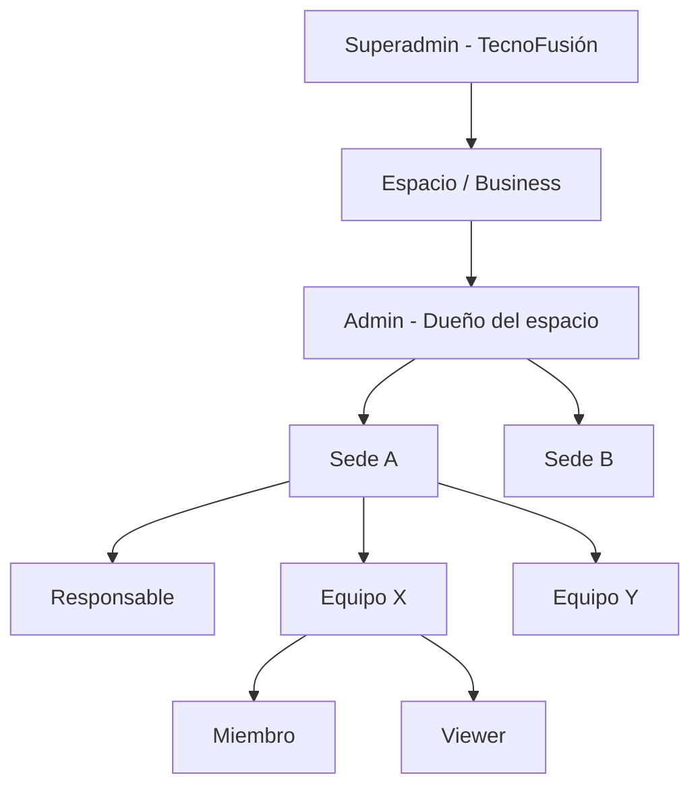
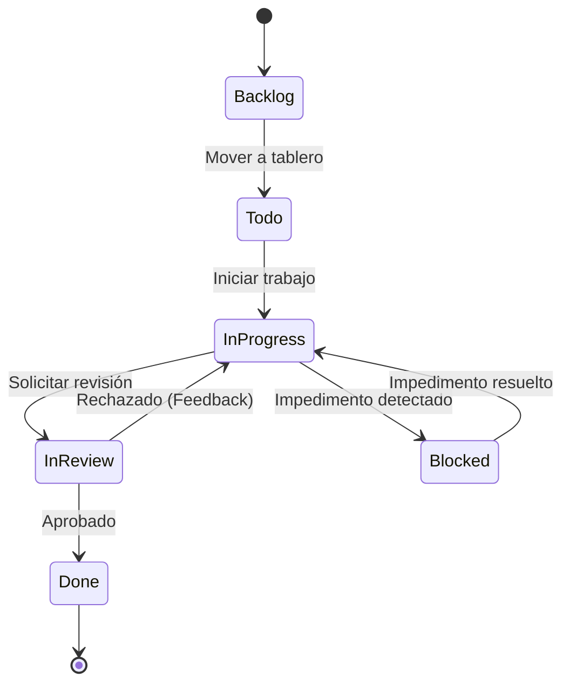
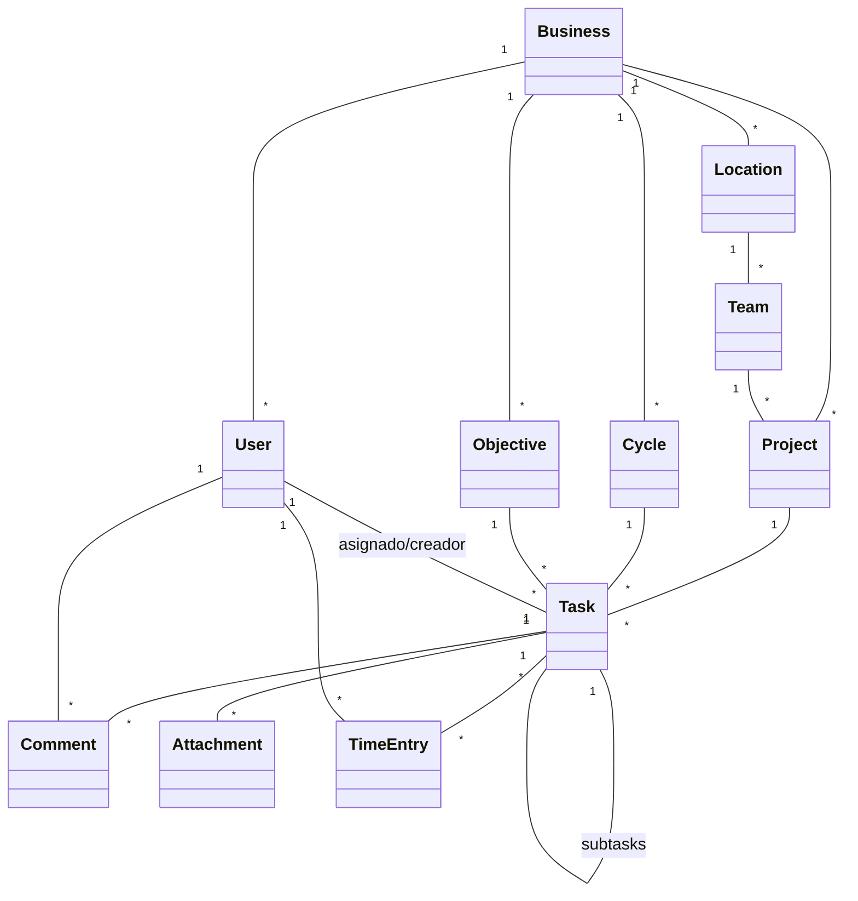

# Glosario y Modelos (Tablero de Control)

Este documento centraliza las definiciones de negocio y los modelos visuales que rigen la lógica del sistema, asegurando que todos los participantes (desarrolladores, analistas y usuarios) utilicen el mismo lenguaje.

## 1. Glosario de Términos

### 1.1 Términos de Negocio (Dominio)
- **Espacio (Business)**: Entidad raíz en UI; modelo Prisma `Business`. Representa la empresa, proyecto o workspace del cliente (ej. "Cadena de Restaurantes X" o "App mobile v2"). Contenedor de multi-tenancy y facturación.
- **Sede (Location)**: Unidad física o lógica del espacio: sucursal, depósito u oficina. En UI reemplaza el término ambiguo "sector" para locations.
- **Equipo (Team)**: Grupo de usuarios que comparten tareas y tableros.
- **Tarea (Task)**: La unidad mínima de trabajo. Posee estado, prioridad, tipo y responsables.
- **Proyecto (Project)**: Contenedor de trabajo. Entrá y usás el mismo Kanban (backlog + sprint). Local, causa, campaña o producto: mismo funcionamiento. Se puede archivar. Completar/fecha límite es opcional si “se cierra”. Modelo Prisma: `Project`. En UI se dice **proyecto**, no “tablero”.
- **Ciclo / Período (Cycle)**: Período de tiempo definido (ej. semana, quincena, mes, temporada) donde un equipo planifica y ejecuta un set de tareas. Reemplaza el concepto de "Sprint" con terminología genérica.
- **Objetivo / Iniciativa (Objective)**: Agrupador de tareas con meta común que **se completa**. Fecha opcional. El espacio puede renombrarlo (Causa, Campaña, Iniciativa). Ejemplos: "Apertura Sucursal Palermo", "Causa Pérez", "SEO cliente X".
- **Backlog**: No es una entidad. Es el estado `backlog` de una **tarea** (cola de ideas). No cuenta como trabajo pendiente en Agenda/KPIs. Distinto de Objetivo.
- **Responsable**: Usuario con autoridad sobre un Local o Equipo.
- **Registro de tiempo (Time Entry)**: Log de horas trabajadas sobre una tarea por un usuario específico.

### 1.2 Términos Técnicos
- **RBAC (Role-Based Access Control)**: Control de acceso basado en roles. El sistema usa 5 niveles de jerarquía.
- **Multi-tenant**: Arquitectura que permite atender a múltiples clientes (negocios) desde una única instancia de software, aislando lógicamente sus bases de datos.
- **Repository Pattern**: Patrón que desacopla la lógica de negocio de la infraestructura de persistencia (Firebase/PostgreSQL).
- **Zustand**: Biblioteca de gestión de estado para la UI (ej. modales, filtros locales).
- **React Query**: Gestor de estado del servidor que maneja cache, sincronización y reintentos.

---

## 2. Modelos Visuales

### 2.1 Jerarquía Organizacional y Roles
El sistema sigue una estructura piramidal para la gestión de permisos y datos.

### 2.2 Ciclo de Vida de una Tarea
Las tareas transitan entre estados permitidos según la lógica del flujo de trabajo Kanban.

### 2.3 Modelo de Datos Principal (Resumen Prisma)
Relación simplificada entre las entidades clave.

---

## 3. Convenciones de Nomenclatura

Para mantener el sistema genérico y aplicable a cualquier industria, **evitar términos de software**:

| ❌ No usar | ✅ Usar en su lugar |
|---|---|
| Sprint | Ciclo / Período |
| Epic | Objetivo / Iniciativa |
| Story Point | (no usar) — usar horas estimadas |
| Bug | Problema / Mejora (según tipo de tarea) |
| Release | (no aplica en MVP) |
| Board | Tablero |
