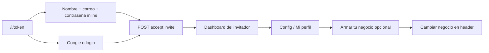

# Invitaciones, colaboradores y negocios propios

Resumen de una página para el equipo. Detalle en los docs enlazados.

## Problema que resolvimos

Antes, usuarios que entraban por link de invitación (`/i/{token}`) podían terminar con un negocio fantasma **"Empresa de {nombre}"** (auto-provision en `GET /api/auth/profile` o auto-registro en login). Veían dos equipos en el header sin haber pedido un negocio propio.

## Modelo actual

| Tipo | Cómo entra | ¿Negocio propio al entrar? | Crear negocio después |
|------|------------|------------------------------|------------------------|
| **Colaborador** | Link `/i/{token}` + **Unirme al equipo** | No | Config → **Armar tu negocio** o atajo en selector del header |
| **Dueño SaaS** | `/register` (correo o **Google**, sin redirect `/i/`) | Sí (`POST /api/auth/register`) | Selector → **Armar otro negocio** |
| **Superadmin** | Email en `SUPERADMIN_EMAILS` | Auto-provision en profile | N/A |

Un mismo usuario puede ser colaborador en el negocio A y dueño del negocio B (`UserBusiness` multi-tenant).

## Cómo se genera el link (Equipo)

| Botón en Equipo | Modal | Entrega | Usos |
|-----------------|-------|---------|------|
| **Invitar usuario** | `create-user-modal.tsx` | Correo (nombre+email) o link | Con correo: 1 uso; link: 1 uso |
| **Link de invitación** | `create-invite-modal.tsx` | Link compartible o correo | Link: `maxUses` (0 = ilimitado); correo: 1 uso |

Ambos llaman `POST /api/invites` y apuntan a `/i/{id}`.

## Flujo colaborador (resumen)

El alta inline pide **nombre + correo + contraseña**. El correo es obligatorio: `prepare-account` valida formato, rechaza duplicados (`409 email_already_exists`) y devuelve `{ username, email }` con el correo real. El `username` se sigue generando para permitir login por nombre vía `GET /api/auth/resolve?login=…`.

El email sintético `{username}@guest.local` (`syntheticEmail()`) quedó **solo** para el alta manual por admin en `POST /api/users/create`, donde el admin puede dar de alta a alguien sin correo.

## Archivos clave

| Área | Archivos |
|------|----------|
| API profile / register | `src/app/api/auth/profile/route.ts`, `register/route.ts` |
| Accept invite | `src/app/api/invites/[token]/accept/route.ts` |
| Crear negocio opt-in | `src/app/api/businesses/route.ts` |
| Auth client | `src/hooks/auth-context.tsx`, `src/hooks/protected-route.tsx` |
| Login / invite UI | `src/app/(auth)/login/page.tsx`, `src/app/(auth)/register/page.tsx`, `src/app/i/[token]/invite-client.tsx` |
| Modales Equipo | `src/components/equipo/create-user-modal.tsx`, `create-invite-modal.tsx` |
| Armar negocio | `src/components/config/create-own-business-card.tsx`, `src/components/business-switcher.tsx` |
| Limpieza datos | `scripts/cleanup-invite-phantom-businesses.ts` |

## Limpieza de negocios fantasma

Script para borrar negocios `Empresa de …` creados por error en usuarios con invitación. Ver [`docs/development.md`](development.md#limpieza-de-negocios-fantasma-por-invitación).

Ejecución mayo 2026: 2 negocios eliminados en Railway (misma DB que dev/test).

## Documentación relacionada

- [`docs/permissions.md`](permissions.md) — reglas de auth e invitación
- [`docs/frontend.md`](frontend.md) — UI, componentes, flujos
- [`docs/api-routes.md`](api-routes.md) — endpoints auth / invites / businesses
- [`docs/models.md`](models.md) — `accountIntent`, campos de profile
- [`docs/decisions/006-collaborator-vs-owner-account.md`](decisions/006-collaborator-vs-owner-account.md) — ADR
- [`docs/testing.md`](testing.md) — fixtures y tests
